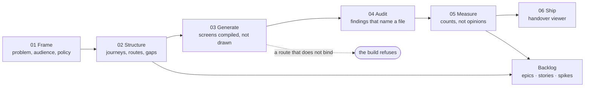

# measured-design

**Design a product you can prove.** Checks that print a number about screens you already have, a
build that refuses when the route map lies, and a backlog generated from the design rather than from
a meeting — as an installable skill pack for Claude Code, Codex, and any agent that reads `SKILL.md`.

[](https://github.com/VeghV03/measured-design-skills/actions/workflows/ci.yml)
[](LICENSE)
[](#install-the-skills)
[](#install-the-skills)
[](#what-is-in-it)
[](#what-is-in-it)

Design reviews go wrong in a predictable way: two people hold different opinions about a screen, the
more senior opinion wins, and nobody learns anything. The fix is not more process. It is arranging the
work so that most questions have an answer that can be counted, and spending the meeting only on the
ones that genuinely cannot.

```
158 → 0   jargon words outside Advanced
 42 → 0   screens with no heading
 22 → 0   routes pointing at nothing
 14 → 0   chips painting over a column
```

Every one of those was invisible until something counted it. None would have come up in a review.

## Contents

- [See it working](#see-it-working)
- [What it actually is](#what-it-actually-is)
- [Three ways in](#three-ways-in)
- [Why it works the way it does](#why-it-works-the-way-it-does)
- [How it fits together](#how-it-fits-together)
- [Install the skills](#install-the-skills)
- [What is in it](#what-is-in-it)
- [Two standing rules](#two-standing-rules)
- [Contributing](#contributing)
- [Provenance and licences](#provenance-and-licences)

## See it working

This is `examples/demo`, built from a scope document — a handover viewer, a failure state carrying an
undeclared claim in orange, and the gate refusing a broken build before it reaches a prototype:


Nobody hand-wrote that rationale panel, that gap warning, or that refusal. All three fall out of the
build. **[Open the live demo](https://veghv03.github.io/measured-design-skills/)** and click around it
now, or clone the repo and have the same file in under a minute.

## What it actually is

Two things that share a data model, and you do not need both.

The first is **a set of checks that run against any web app** — contrast against the real composited
background, content off the frame at each supported width, targets under the minimum, animation that
ignores reduced motion, screens with no heading. Thirteen of them. They need a URL and nothing else.
No adoption, no scope document, no buy-in from anyone.

The second is **a procedure for designing a product so that those numbers stay fixed** — six stages,
one build contract, and a gate that refuses. Screens are generated from a data model rather than drawn,
so the thing you measure and the thing you ship are the same object. From that model it also writes
the backlog: epics, stories, and the decisions nobody has made yet, as tickets that block the work
waiting on them.

It is built for agents but none of it requires one. The skills tell an agent how to run the procedure;
the CLI, the gate, the harnesses and the backlog generator are ordinary programs you can run yourself.

## Three ways in

### Measure an app you already have — about a minute

```sh
npx measured-design init      # detects the project, writes a config, runs the checks
npx measured-design check
```

It reads your `package.json`, finds the dev server if one is running or the build output if not, and
prints one number per check. Eleven of the thirteen need only a DOM; route binding wants a declared
route map and the vocabulary check wants a word list, and both say so rather than guessing.

Then make the number go one way — the arrow at the top of this page only exists if something
remembers yesterday:

```sh
npx measured-design baseline        # freeze today's findings
npx measured-design check --no-new  # fail only on a finding that is not in the baseline
```

```
  new since the baseline
    73f98ce938a4  lang · files-list: no <html lang> — a screen reader has to guess

155 baselined · 1 new · 3 fixed · 1 waived
```

**Nobody fixes 158 things. Everybody can stop the 159th.** That is the line to put in CI on day one of
a codebase that already exists. Disagreeing with a finding is allowed and rather the point — the
decision just gets written down, with a reason and a date, instead of winning an argument:

```sh
npx measured-design waive 73f98ce938a4 --why "Marketing shell, lang set by the CMS" --until 2027-01-01
```

### Turn a design into a backlog

A design that cannot become planned work stays a picture.

```sh
python3 scaffold/backlog/build_backlog.py --model model      # a measured-design project
python3 scaffold/backlog/build_backlog.py --plan plan.json   # a brief, a crawled app, a codebase
```

Journeys become epics, steps become stories, screens become sub-tasks. **An open decision becomes a
spike that blocks every story touching it**, ranked ahead of what it holds up, so the board shows the
cost of not deciding instead of hiding it in a description. A gap in the scope becomes a story flagged
as having nothing serving it. Acceptance criteria name the harness that proves them.

The one thing it will not do is invent the reason:

```
When I am in Files and choose Move to folder…, I want to move a file into a folder,
so I can ⟨outcome — one line, from whoever knows why this step exists⟩.
```

A rationale explains why a screen is shaped as it is. It is not what a person walks away with, and the
nearest available sentence would put a claim nobody made into a ticket somebody builds. The blanks are
counted instead.

Out comes `backlog.md` to read and `jira.csv` to import; `--push` creates the issues directly, and
creates rather than edits. Details in [`scaffold/backlog/README.md`](scaffold/backlog/README.md),
worked examples in [`examples/demo`](examples/demo) and
[`examples/standalone-backlog`](examples/standalone-backlog).

### Run the whole procedure

```sh
cd examples/demo
python3 ../../scaffold/adapters/python/build.py  --boards boards --model model
python3 ../../scaffold/gate.py                   --model model --boards boards
python3 ../../scaffold/viewer/build_viewer.py    --model model --boards boards --out prototype.html \
                                                 --title "Demo · File manager"
python3 ../../scaffold/drift.py scope.md         --model model
open prototype.html
```

Ten screens across four journeys, built, gated and shipped. The gate prints one line per property and
writes `model/index.json`. Break a route label in `routes.json` and it refuses instead, which is the
point.

For the harnesses: `cd scaffold/harnesses && npm install && node run-all.mjs`. They need Playwright and
a Chromium. They do not require the rest of the pack — `target` points them at built files, an explicit
route list, or a crawl:

```json
{ "target": { "mode": "dir",   "dir": "./dist" } }
{ "target": { "mode": "urls",  "base": "http://localhost:3000", "routes": ["/", "/files"] } }
{ "target": { "mode": "crawl", "start": "http://localhost:3000", "limit": 50 } }
```

## Why it works the way it does

**Screens are compiled, not drawn.** A design tool gives you 93 files that drift; a generator gives you
93 files that cannot. Any stack satisfies the contract — Python is the reference adapter, not the
requirement. There are three, sharing no code, and CI proves they emit byte-identical rationale for the
same model. The React one also emits `.tsx`, so the boards stay measurable and the components are what
you keep.

**The rationale lives in the generator.** Put the reasoning in the docstring and extract it at build
time, and it physically cannot drift from the screen, because they are the same object. No separate
rationale document going stale in a fortnight.

**Exactly one check refuses.** A route map that lies to QA is worse than a missing one, so the gate
will not produce a prototype if a declared route fails to bind. Everything else prints a number and
lets a person decide. Adding a second refusing check is a decision with a cost — every future
contributor has to satisfy it before they can look at anything — and the pack says so out loud.

**A finding is identified by what it is.** Not by where it sat in a run's output. That one choice is
what makes a baseline possible, what lets a waiver name a single thing, and what lets a renamed story
keep its Jira ticket while a restructured epic correctly becomes new work.

**Where they disagree, the audited prototype wins.** The scope document is brought level with it, not
the other way round. Otherwise every audit finding is optional.

## How it fits together



Stages are not gates you pass once. Audit sends work back to generate; measure sends work back to
audit. Only the contract is fixed. The backlog is reachable as soon as there are journeys and routes,
and is worth rebuilding after the audit — the audit changes what the work is, and a backlog written
before it plans the product you thought you had.

## Install the skills

```sh
sh scripts/install.sh claude          # ~/.claude/skills
sh scripts/install.sh codex           # ~/.agents/skills
sh scripts/install.sh any ./skills    # anywhere else
```

`--core` installs the eleven measured-design skills plus standalone `jira-backlog`, without the
88-skill library. Codex caps its pre-loaded skill list at about 8,000 characters and truncates silently
past that; 100 skills would not fit. The library skills are marked `disable-model-invocation` for the
same reason — they are reached deliberately from a stage, not picked up opportunistically.

Claude Code can also add the directory as a marketplace (`.claude-plugin/marketplace.json`).

## What is in it

| | |
|---|---|
| `skills/measured-design` | the entry point; routes to the six stages |
| `skills/measured-design-contract` | the build contract — read before generating anything |
| `skills/measured-design-{frame,structure,generate,audit,measure,ship}` | stages 01–06 |
| `skills/measured-design-decide` | an open question forced into options carrying what each buys, costs and kills |
| `skills/measured-design-drift` | scope document versus prototype |
| `skills/measured-design-backlog` | the design as planned work — epics, stories, spikes that block |
| `skills/jira-backlog` | the same, standalone: a brief, a running app or a codebase → Jira |
| `skills/library/` | 88 vendored designer and thinking skills |
| `cli/` | `npx measured-design init`, `check`, `baseline`, `waive` — the no-adoption entry point |
| `commands/` | `/prove`, `/backlog` and nine others, for agents with slash commands |
| `scaffold/gate.py` | refuses the build on a route that does not bind |
| `scaffold/check_library.py` | refuses if a vendored skill is unreachable, or a stage names one that does not exist |
| `scaffold/harnesses/` | thirteen checks — twelve in any one run, each prints one number and writes its findings |
| `scaffold/backlog/` | one plan, one emitter — `backlog.json`, `jira.csv`, `backlog.md`, and `--push` |
| `scaffold/viewer/` | the handover artifact — one file, no dependencies |
| `scaffold/adapters/{python,node,react}` | three generators, no shared code, proving the contract is stack-agnostic |
| `examples/demo/` | ten screens across four journeys that build, gate and ship end to end |
| `examples/standalone-backlog/` | an invoicing product planned from a two-page brief, with no `model/` at all |
| `.github/workflows/ci.yml` | library reachability, all three adapters, the gate, the harnesses, the ratchet and the backlog — on every push |

## Two standing rules

**Run the designer skills and the thinking skills together.** A design skill tells you what good looks
like in its own lane; a thinking skill catches what that lane's answer breaks two screens away. The
per-stage pairing is a **proposal**, written up separately in `PAIRING.md` — it is the one part of this
pack that is not in the source procedure.

**Something that prints a number beats something that adds a meeting.** That is the test for anything
added here.

## Contributing

The core is deliberately small — eleven skills, one contract, one gate. Most of the value in growing it
is in:

- **New harnesses.** Each prints a single number for a single property. If you have a check that would
  have caught a real regression, `scaffold/harnesses/` is where it goes.
- **New adapters and new backlog front ends.** Both are contracts, not implementations. A generator for
  another stack, or something that reads Figma or a Linear export into a plan, plugs into the same
  emitter.
- **Sharper pairings.** `PAIRING.md` is argued from one project. If a stage's pairing does not hold on
  yours, open an issue with the counter-example.
- **Bug reports with the input attached.** "This refused when it should not have" is far more useful
  with the `routes.json` that triggered it.

`CONTRIBUTING.md` has the shape a harness or an adapter needs to take, and the issue templates ask for
the input that reproduces a bug.

If this saved you a design review, a star is how other people find it.

## Provenance and licences

The procedure is derived from a file manager redesign carried out in September 2026. The worked
examples throughout are from that project.

`skills/library/` vendors 88 skills from two MIT-licensed repositories, unmodified except for the
frontmatter `name` and a provenance comment:

- **designer-skills** — MIT, MC Dean. `licenses/designer-skills-MIT.txt`
- **cc-thinking-skills** — MIT, TJ Boudreaux. `licenses/cc-thinking-skills-MIT.txt`

Every vendored skill is renamed to a collection-qualified form — `ux-strategy-frame-problem`, not
`frame-problem`. Codex does not merge skills sharing a `name`; it shows both in the selector, so
nothing collides if you have the upstream packs installed too. `skills/library/INDEX.md` maps every
qualified name back to its upstream id.

This pack is MIT. See `LICENSE`.
