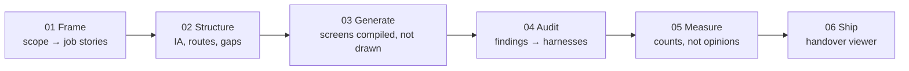

# measured-design

**Designing a product you can prove.** A measured UX/UI procedure, as an installable skill pack
for Claude Code, Codex, and any agent that reads `SKILL.md`.

[](https://github.com/VeghV03/measured-design-skills/actions/workflows/ci.yml)
[](LICENSE)
[](#install)
[](#install)
[](#what-is-in-it)
[](#what-is-in-it)

Design reviews go wrong in a predictable way: two people hold different opinions about a screen, the
more senior opinion wins, and nobody learns anything. The fix is not more process. It is arranging
the work so that most questions have an answer that can be counted, and spending the meeting only on
the ones that genuinely cannot.

```
158 → 0   jargon words outside Advanced
 42 → 0   screens with no heading
 22 → 0   routes pointing at nothing
 14 → 0   chips painting over a column
```

Every one of those was invisible until something counted it. None would have come up in a review.

## See it, don't just read about it

This is the actual output of `examples/demo` — a handover viewer built from a scope document, a
failure state with an undeclared claim flagged in orange, and the gate refusing a broken build before
it ever reaches a prototype:


Nobody hand-wrote that rationale panel, that gap warning, or that refusal. All three came out of the
build in [Try it in thirty seconds](#try-it-in-thirty-seconds) below — clone the repo and you'll have
this same file, for this same demo, in under a minute. Or skip the clone:
**[open the live demo](https://veghv03.github.io/measured-design-skills/)** and click around it right now.

## Contents

- [How it fits together](#how-it-fits-together)
- [Install](#install)
- [Make the number go one way](#make-the-number-go-one-way)
- [Try it in thirty seconds](#try-it-in-thirty-seconds)
- [What is in it](#what-is-in-it)
- [What makes this different from a process document](#the-three-things-that-make-this-different-from-a-process-document)
- [Two standing rules](#two-standing-rules)
- [Contributing](#contributing)
- [Provenance and licences](#provenance-and-licences)

## How it fits together

Six stages, one contract, one refusing gate:



A route the contract declares but nothing binds stops the build at stage 3. Everything else — jargon,
missing headings, empty states, contrast — prints a number at stage 5 and lets a person decide what to
do with it.

## Start on a project you already have

```sh
npx measured-design init
```

It reads your `package.json`, finds the dev server if one is running (or the build output if not),
writes `measured-design.config.json`, and runs the checks. No scope document, no data model, no
adoption — a number about screens you have already built, in about a minute. Afterwards:

```sh
npx measured-design check
```

Two of the thirteen checks need more than a DOM and will say so rather than guessing: route binding
wants a declared route map, the vocabulary check wants a word list. The other eleven just run.

## Make the number go one way

A number you saw once is a fact about a Tuesday. The arrow at the top of this page is the part that
matters, and it only exists if something remembers yesterday.

```sh
npx measured-design baseline        # freeze today's findings
npx measured-design check --no-new  # fail only on a finding that is not in the baseline
```

Nobody fixes 158 things. Everybody can stop the 159th. `baseline` writes
`measured-design.baseline.json` — every finding fingerprinted by what it is, not by where it sat in
that run's output — and `--no-new` exits non-zero only on a fingerprint that was not already there.
That is the line to put in CI on day one of a codebase that already exists.

```
  new since the baseline
    73f98ce938a4  lang · files-list: no <html lang> — a screen reader has to guess

155 baselined · 1 new · 3 fixed · 1 waived
```

Findings that leave the baseline are reported too. A fix nothing notices is a fix nobody gets credit
for, and `baseline --update` locks the gain in so it cannot come back.

Disagree with a finding? That is allowed, and it is the point — but the decision gets written down
instead of winning an argument:

```sh
npx measured-design waive 73f98ce938a4 --why "Marketing shell, lang set by the CMS" --until 2027-01-01
```

`--why` is required, because a waiver without a reason is an opinion that won. `--until` is not, but a
waiver without one is reported on every run so it cannot quietly become permanent — and an expired
waiver brings its finding straight back. A waiver matching nothing is reported too, so the file does
not rot.

Every run also writes `.measured-design/findings.json`: the whole run, one record per finding, with
the fingerprint. That is the file to build a report or a PR comment out of.

That is the shallow end. The rest of this README is the part that makes the numbers stay fixed.

## Install the skills

```sh
sh scripts/install.sh claude          # ~/.claude/skills
sh scripts/install.sh codex           # ~/.agents/skills
sh scripts/install.sh any ./skills    # anywhere else
```

Add `--core` to install the ten measured-design skills without the 88-skill library. Codex caps its
pre-loaded skill list at about 8,000 characters and truncates silently past that; 98 skills would not
fit. The library skills are marked `disable-model-invocation` for the same reason — they are reached
deliberately from a stage, not picked up opportunistically.

Claude Code can also add the directory as a marketplace (`.claude-plugin/marketplace.json`).

## Try it in thirty seconds

```sh
cd examples/demo
python3 ../../scaffold/adapters/python/build.py  --boards boards --model model
python3 ../../scaffold/gate.py                   --model model --boards boards
python3 ../../scaffold/viewer/build_viewer.py    --model model --boards boards --out prototype.html
python3 ../../scaffold/drift.py scope.md         --model model
open prototype.html
```

The gate prints one line per property and writes `model/index.json`. Break a route label in
`routes.json` and it refuses instead, which is the point.

For the harnesses: `cd scaffold/harnesses && npm install && node run-all.mjs`. They need Playwright
and a Chromium; set `executablePath` in `harness.config.json` if yours is not on the default path.

They do not require the rest of the pack. Ten of the thirteen only need a URL and a name, so
`target` in `harness.config.json` points them at a folder of built boards, an explicit route list, or
a crawl of a running app:

```json
{ "target": { "mode": "dir",   "dir": "../../boards" } }
{ "target": { "mode": "urls",  "base": "http://localhost:3000", "routes": ["/", "/files"] } }
{ "target": { "mode": "crawl", "start": "http://localhost:3000", "limit": 50 } }
```

Two checks need more than a DOM. `routes` proves a declared route map binds to real labels on real
screens and needs `model/`; without one, `run-all` substitutes `links`, which only proves nothing
404s — a weaker claim, named differently on purpose. `vocab` needs a word list, so it reads
`model/policy.json` or a standalone `vocab.policy.json`, and says so when it finds neither.

## What is in it

| | |
|---|---|
| `skills/measured-design` | the entry point; routes to the six stages |
| `skills/measured-design-contract` | the build contract — read before generating anything |
| `skills/measured-design-{frame,structure,generate,audit,measure,ship}` | stages 01–06 |
| `skills/measured-design-decide` | an open question forced into multiple choice with trade-offs |
| `skills/measured-design-drift` | scope document versus prototype |
| `skills/library/` | 88 vendored designer and thinking skills |
| `cli/` | `npx measured-design init`, `check`, `baseline` and `waive` — the no-adoption entry point |
| `cli/ratchet.mjs` | the baseline, the waivers, and the comparison that makes a number go one way |
| `commands/` | `/prove` and nine others, for agents with slash commands |
| `scaffold/gate.py` | refuses the build on a route that does not bind |
| `scaffold/check_library.py` | refuses if a vendored skill is unreachable, or a stage names one that does not exist |
| `scaffold/harnesses/` | thirteen checks — twelve in any one run, each prints one number and writes its findings |
| `scaffold/viewer/` | the handover artifact — one file, no dependencies |
| `scaffold/adapters/python/` | the reference generator |
| `scaffold/adapters/node/` | a second generator, no dependencies — same screens, same rationale, proving the contract is stack-agnostic |
| `scaffold/adapters/react/` | a third generator that also emits `.tsx` components from the same tree — the boards stay measurable, the components are what you keep |
| `examples/demo/` | ten screens across four journeys that build, gate and ship end to end |
| `.github/workflows/ci.yml` | checks library reachability, builds the demo with all three adapters, gates it, typechecks the emitted components, runs all twelve harnesses, on every push |

## The three things that make this different from a process document

**Screens are compiled, not drawn.** A design tool gives you 93 files that drift; a generator gives
you 93 files that cannot. Any stack satisfies the contract — Python is the reference adapter, not the
requirement, and `scaffold/adapters/node/` is a second one built to prove it: same ten demo screens,
same rationale text, same gate and harness results, zero shared code.

**The rationale lives in the generator.** Put it in the docstring and extract it at build time, and
the reasoning physically cannot drift from the screen, because they are the same object. There is no
separate rationale document going stale in a fortnight.

**One check refuses.** A route map that lies to QA is worse than a missing one, so the gate will not
produce a prototype if a declared route fails to bind. Everything else prints a number and lets a
person decide. Adding a second refusing check is a decision with a cost, and the pack says so.

## Two standing rules

Run the designer skills and the thinking skills together. A design skill tells you what good looks
like in its own lane; a thinking skill catches what that lane's answer breaks two screens away. The
per-stage pairing is a **proposal** and is written up separately in `PAIRING.md` — it is the one part
of this pack that is not in the source procedure.

Where a prototype and a scope document both exist, the audited prototype dictates. The scope document
is brought level with it, not the other way round, otherwise every audit finding is optional.

## Contributing

The pack is deliberately small at its core — ten skills, one contract, one gate. Most of the value in
growing it is in:

- **New harnesses.** Each one prints a single number for a single property. If you have a check that
  would have caught a real regression, `scaffold/harnesses/` is the place for it — see the existing
  ones for the shape.
- **New adapters.** `scaffold/adapters/python/` is the reference, not the requirement. A generator for
  another stack that satisfies the same build contract is welcome.
- **Sharper pairings.** `PAIRING.md` is a proposal, argued from one project. If a stage's thinking-skill
  pairing does not hold up on yours, open an issue with the counter-example.
- **Bug reports with the counter-example attached.** "This refused when it should not have" is far more
  useful with the `routes.json` that triggered it than without.

Open an issue or a pull request — `CONTRIBUTING.md` has the shape a harness or adapter needs to take,
and the issue templates ask for the input that reproduces a bug. Keep additions consistent with the
rest of the pack: something that prints a number beats something that adds a meeting.

If this saved you a design review, a star on the repo is how other people find it.

## Provenance and licences

The procedure is derived from a file manager redesign carried out in September 2026.
The worked examples throughout are from that project.

`skills/library/` vendors 88 skills from two MIT-licensed repositories, unmodified except for the
frontmatter `name` and a provenance comment:

- **designer-skills** — MIT, MC Dean. `licenses/designer-skills-MIT.txt`
- **cc-thinking-skills** — MIT, TJ Boudreaux. `licenses/cc-thinking-skills-MIT.txt`

Every vendored skill is renamed to a collection-qualified form — `ux-strategy-frame-problem`, not
`frame-problem`. Codex does not merge skills sharing a `name`; it shows both in the selector. If you
have the upstream packs installed as well, nothing collides. `skills/library/INDEX.md` maps every
qualified name back to its upstream id.

This pack is MIT. See `LICENSE`.
